# GLiNER: Generalist Model for Named Entity Recognition using Bidirectional Transformer
[GLiNER](https://arxiv.org/pdf/2311.08526)

## 1. Architechture

```mermaid
flowchart LR
    input1{list_input_text} --> f1[collate_fn]
    input2{labels} --> f1[collate_fn]
    f1[collate_fn] -- seq_length --> concat1[concat]
    f1[collate_fn] -- class2idx --> f2[get all label]
    f2[get all label] --> f3[Add entity_token]
    f3[Add entity_token] --> concat2[concat]
    f1[collate_fn] -- tokens --> concat2[concat]
    f3[Add entity_token] --prompt_entity_length--> concat1[concat]
    concat1[concat] --seq_length_p--> layer1((token_rep_layer))
    concat2[concat] --tokens_p--> layer1((token_rep_layer))
    layer1((token_rep_layer)) --> a1[[embeddings]]
    layer1((token_rep_layer)) --> a2[[mask]]
    a1[[embeddings]] --> f4[remove_entity]
    f4[remove_entity] -- word_rep --> layer2((rnn))
    a2[[mask]] --> f5[remove_entity]
    f5[remove_entity] -- mask_rep --> layer2((rnn))
    a1[[embeddings]] --> f6[remove_entity_and_entity_token]
    f1[collate_fn] -- span_idx --> f[multiplication]
    f1[collate_fn] -- span_mask --> f[multiplication]
    f[multiplication] --> a3[[span_idx]]
    layer2((rnn)) -- word_rep --> layer3((span_rep_layer))
    a3[[span_idx]] --> layer3((span_rep_layer))
    f6[remove_entity_and_entity_token] --entity_type_rep--> layer4((prompt_rep_layer))
    layer4((prompt_rep_layer)) --entity_type_rep-->layer5((torch.einsum: BLKD,BCD->BLKC))
    layer3((span_rep_layer)) --span_rep-->layer5((torch.einsum: BLKD,BCD->BLKC))
    layer5((torch.einsum: BLKD,BCD->BLKC)) --local_scores--> layer6((torch.sigmoid))
    layer6((torch.sigmoid)) --> f10[Post processing with Greedy search]
    f10[Post processing with Greedy search] --> out{Ouput}
```

- Detail:
    - `span_idx` and `span_mask`:
        - `span_idx`: shape batch_size x lenght x 2 ( this is list of tuple (start_index, end_index))
            - examples: [[0,0], [1,1], [2,2],...[lengt-1, lenght-1]]
        -  `span_mask`: shape batch_size x lenght
    - `Add entity_token`: add `<<ENT>>` alternating between labels

        examples: `['Peoples','Org']` -> `<<ENT>>` `Peoples` `<<ENT>>` `Org` `<<ENT>>`
    - span_rep_layer
        ```python
        TokenRepLayer(
            (bert_layer): TransformerWordEmbeddings(
            (model): DebertaV2Model(
                (embeddings): DebertaV2Embeddings(
                (word_embeddings): Embedding(128004, 1024)
                (LayerNorm): LayerNorm((1024,), eps=1e-07, elementwise_affine=True)
                (dropout): StableDropout()
                )
                (encoder): DebertaV2Encoder(
                (layer): ModuleList(
                    (0-23): 24 x DebertaV2Layer(
                    (attention): DebertaV2Attention(
                        (self): DisentangledSelfAttention(
                        (query_proj): Linear(in_features=1024, out_features=1024, bias=True)
                        (key_proj): Linear(in_features=1024, out_features=1024, bias=True)
                        (value_proj): Linear(in_features=1024, out_features=1024, bias=True)
                        (pos_dropout): StableDropout()
                        (dropout): StableDropout()
                        )
                        (output): DebertaV2SelfOutput(
                        (dense): Linear(in_features=1024, out_features=1024, bias=True)
                        (LayerNorm): LayerNorm((1024,), eps=1e-07, elementwise_affine=True)
                        (dropout): StableDropout()
                        )
                    )
                    (intermediate): DebertaV2Intermediate(
                        (dense): Linear(in_features=1024, out_features=4096, bias=True)
                        (intermediate_act_fn): GELUActivation()
                    )
                    (output): DebertaV2Output(
                        (dense): Linear(in_features=4096, out_features=1024, bias=True)
                        (LayerNorm): LayerNorm((1024,), eps=1e-07, elementwise_affine=True)
                        (dropout): StableDropout()
                    )
                    )
                )
                (rel_embeddings): Embedding(512, 1024)
                (LayerNorm): LayerNorm((1024,), eps=1e-07, elementwise_affine=True)
                )
            )
            )
            (projection): Linear(in_features=1024, out_features=768, bias=True)
        )
        ```

    - rnn
        ```python
            LstmSeq2SeqEncoder(
                (lstm): LSTM(768, 384, batch_first=True, bidirectional=True)
            )
        ```

    - span_rep_layer
        ```python
        SpanRepLayer(
            (span_rep_layer): SpanMarker(
            (project_start): Sequential(
                (0): Linear(in_features=768, out_features=1536, bias=True)
                (1): ReLU()
                (2): Dropout(p=0.4, inplace=False)
                (3): Linear(in_features=1536, out_features=768, bias=True)
            )
            (project_end): Sequential(
                (0): Linear(in_features=768, out_features=1536, bias=True)
                (1): ReLU()
                (2): Dropout(p=0.4, inplace=False)
                (3): Linear(in_features=1536, out_features=768, bias=True)
            )
            (out_project): Linear(in_features=1536, out_features=768, bias=True)
            )
        )
        ```
    - prompt_rep_layer
        ```python
        Sequential(
            (0): Linear(in_features=768, out_features=3072, bias=True)
            (1): Dropout(p=0.4, inplace=False)
            (2): ReLU()
            (3): Linear(in_features=3072, out_features=768, bias=True)
        )
        ```
## 2. Simple app with gradio
```
pip install -r requirements.txt

make run_app # Run app
make pre_commit # format code
```


## 3. Convert model to onnx, torchscript, triton
    - TODO
